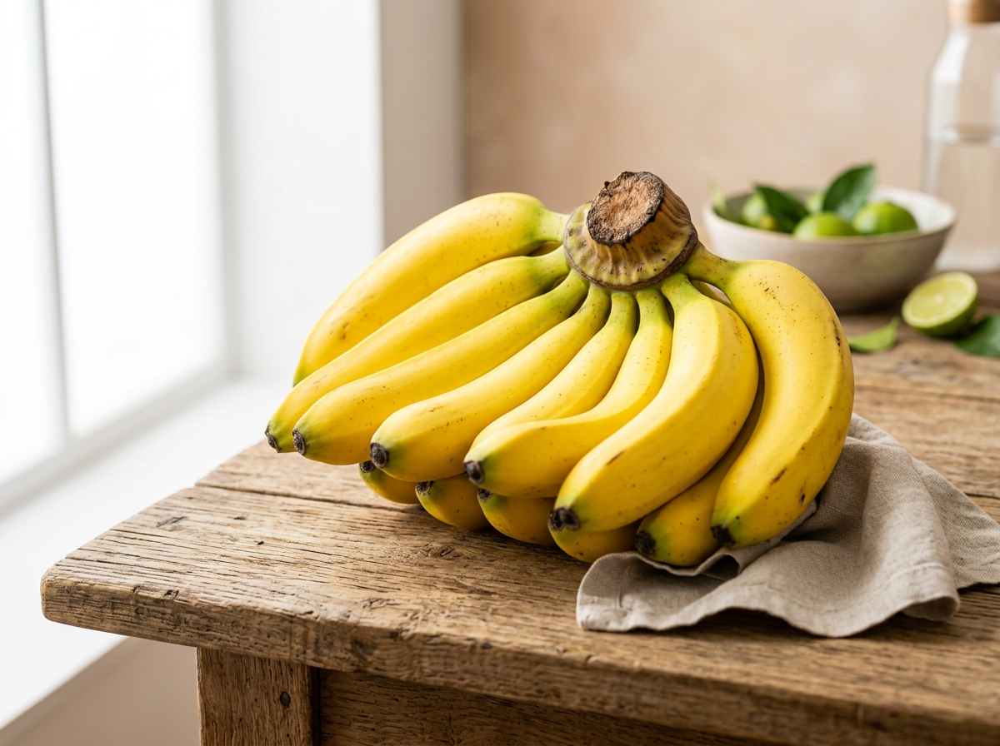

# 🛒 Meu Mercado - Aplicativo de Compras Simples & Inteligente

Um aplicativo web moderno, intuitivo e acessível para montagem de listas de compras de mercado, envio de pedidos formatados via WhatsApp e conferência de entregas com checklist em tempo real.



---

## 🌟 Principais Recursos

- **🚀 Cadastro Assistido em 1 Toque**: Monte sua lista sem digitar, escolhendo Categoria ➔ Produto ➔ Variedade ➔ Marca ➔ Unidade ➔ Detalhes.
- **🖼️ Galeria de Fotos Exclusivas**: 100% dos produtos contam com fotos dedicadas em alta resolução (proporção 4:3).
- **📋 Envio Formatado para WhatsApp**: Mensagem organizada automaticamente por categorias de corredores do mercado (Hortifrúti, Açougue, Laticínios, Padaria, Mercearia, Bebidas, Limpeza, Higiene Pessoal).
- **📦 Checklist & Conferência de Recebimento**: Quando as compras chegam em casa, marque o que veio certo (🟢 Entregue) ou o que faltou/veio errado (🔴 Faltou).
- **📅 Calendário & Reaproveitamento de Pedidos**: Histórico de compras vinculados por data e botão **`[ 🔄 REAPROVEITAR ESTA LISTA ]`** para clonar pedidos passados com 1 toque.
- **💾 Persistência Offline**: Funciona 100% offline via LocalStorage no navegador.

---

## 🛠️ Tecnologias Utilizadas

- **Core**: Next.js 15 (App Router), React 19, TypeScript
- **Estilização**: TailwindCSS, Lucide React Icons
- **Gerenciamento de Estado**: Zustand com Persist Middleware
- **Deploy & Hospedagem**: Vercel & GitHub

---

## 📁 Categorias Disponíveis

1. 🥦 **Hortifrúti** *(Frutas, Legumes, Verduras)*
2. 🥩 **Açougue** *(Carnes Bovinas, Suínas, Tulipas de Frango, Coxinhas da Asa, Linguiças)*
3. 🥛 **Laticínios & Frios** *(Iogurte Fazenda, Natural Neutro, Leite, Manteiga Vigor Mix, Queijos, Requeijão Danubio)*
4. 🍞 **Padaria** *(Pão Francês, Pão de Hambúrguer, Mini Discos de Pizza, Pão de Forma, Bisnaguinha)*
5. 🌾 **Mercearia** *(Arroz Camil 5kg, Feijão Carioca, Açúcar União, Sal Cisne, Café Pilão, Azeitona, Palmito, Azeite, Óleo, Macarrão, Molho)*
6. 🥤 **Bebidas** *(Sucos Prats, Água Mineral, Refrigerantes)*
7. 🧹 **Limpeza** *(Amaciante Baby Soft Azul, Papel Toalha Snob 2 unid, Detergente Ypê, Água Sanitária Qboa, Sabão Omo, Desinfetante)*
8. 🧼 **Higiene Pessoal** *(Sabonete Dove, Shampoo Pantene, Creme Dental Colgate, Papel Higiênico Neve)*

---

## 💻 Como Rodar Localmente

```bash
# Clone o repositório
git clone https://github.com/leodevdesign/mercado-app.git

# Acesse a pasta do projeto
cd mercado-app

# Instale as dependências
npm install

# Inicie o servidor de desenvolvimento
npm run dev
```

Acesse **`http://localhost:3000`** ou **`http://localhost:3010`** no seu navegador!

---

Desenvolvido com carinho para facilitar as compras do dia a dia! 🚀
